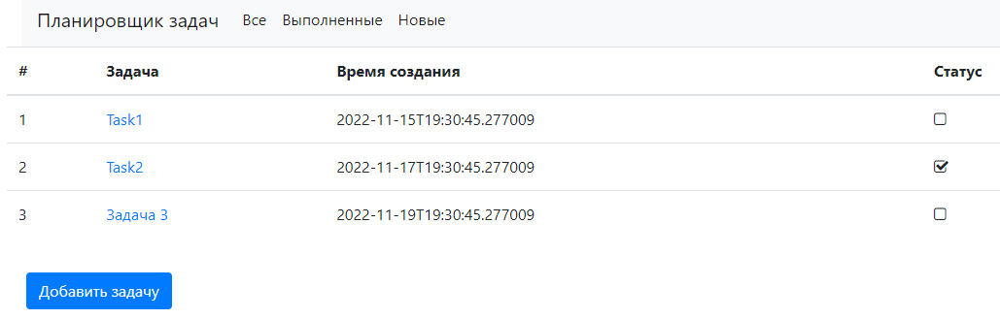
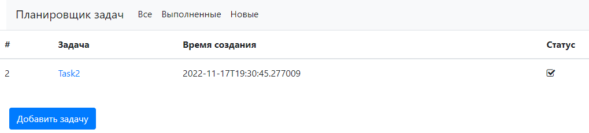
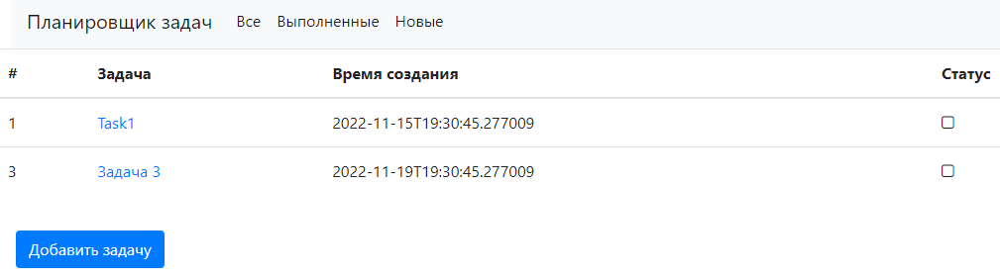
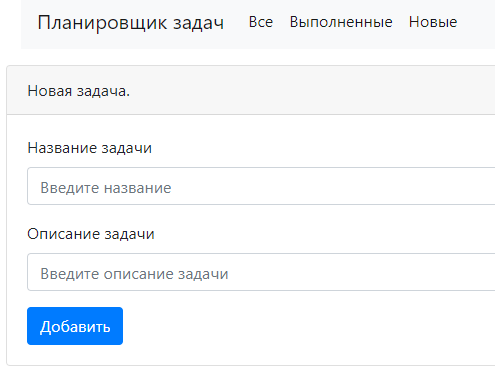
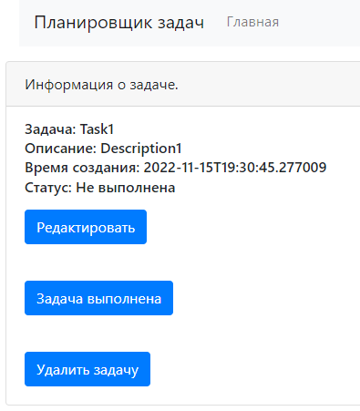
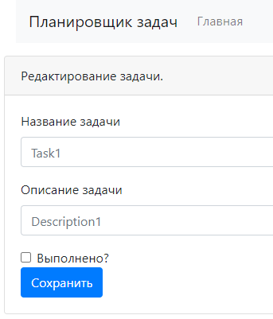

# job4j_todo
### Описание проекта:
Приложение представляет из себя планировщик задач. 
В приложении реализованы функции:
- отображение всего списка задач;
- отображение списка новых задач;
- отображение списка выполненных задач;
- создание, редактирование и удаление задач.

Приложение реализовано на основе паттерна MVC. Имеет три слоя Controller, Service, Persistence.

### Применяемые технологии: 
- Spring boot 2.7.4;
- Thymeleaf;
- Bootstrap 4;
- Hibernate 5.6.11;
- PostgreSql 12;
- Lombok 1.18.22
- Liquibase 4.15.0;
- H2 2.1.214.

### Требования к окружению: 
- Java 17;
- Maven 3.8;
- PostgreSQL 12.

### Запуск проекта:
- Настроить окружение и подключение к серверу БД.
- Создать базу данных, например через утилиту psql:
``` 
create database todo
``` 
- Упаковать проект в jar архив. Для этого выполнить:
``` 
mvn package
```
- Запустить приложение командой:
```
java -jar job4j_todo-1.0.jar
```

### Взаимодействие с приложением:
*Стартовая страница ...*



*Только выполненные задачи ...*



*Только невыполненные задачи ...*



*Создание новой задачи ...*



*Полная информация о задаче ...*



*Редактирование задачи ...*


---

### Контакты
email: [ivan.turutin@gmail.com](mailto:ivan.turutin@gmail.com)